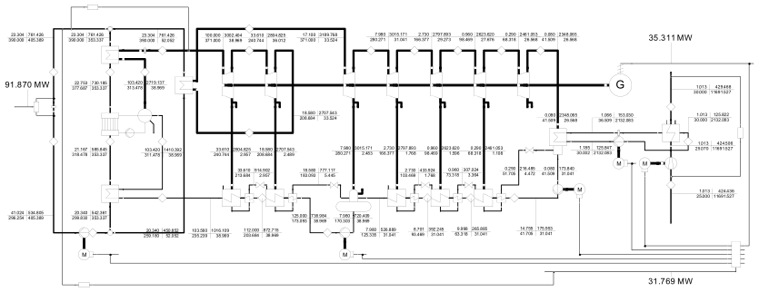

# Exergy Analysis of a Solar Thermal Power Plant in TESPy

Example for the exergy analysis in [TESPy][]. Find more information
about the exergy analysis feature in the respective [online
documentation][].

The so called "Solar Energy Generating System (SEGS)" model has the following
topology:

<figure>

</figure>

## Usage

Clone the repository and build a new python environment. From the base
directory of the repository run

``` bash
pip install -r ./requirements.txt
```

to install the version requirements for the SEGS.py python script.

On top of the python script, an EBSILON model (v14.03.01) for the
identical setup is provided for validation. The results are available in
the respective flowsheet. The solar field is not considered for further
investigation, thus it represents a heat input only.

<figure>

</figure>

The original data of the plant are partially obtained from the following
reports:

*F. Lippke, Simulation of the part-load behavior of a 30 MWe SEGS plant,
Technical Report SAND-95-1293, Sandia National Lab., Albuquerque, 1995.
URL:https://www.osti.gov/biblio/95571. doi:10.2172/95571.*

*D. Kearney, C. E. Miller, Technical Evaluation of Project Feasibilty
for SEGS VI, Technical Report,1988. Submitted to Luz Solar Partners VI.*

## Exergy Analysis Results

### Connection results

|    |   e_PH in kJ/kg |   e_T in kJ/kg |   e_M in kJ/kg |   E_PH in MW |   E_T in MW |   E_M in MW |
|:---|----------------:|---------------:|---------------:|-------------:|------------:|------------:|
| 1  |          1197.3 |         1187.4 |            9.9 |        46.66 |       46.27 |        0.39 |
| 2  |          1197.3 |         1187.4 |            9.9 |        46.66 |       46.27 |        0.39 |
| 3  |           977.5 |          974.2 |            3.3 |        38.09 |       37.96 |        0.13 |
| 4  |           977.5 |          974.2 |            3.3 |        35.20 |       35.08 |        0.12 |
| 5  |           869.2 |          867.5 |            1.8 |        31.30 |       31.24 |        0.06 |
| 6  |           869.2 |          867.5 |            1.8 |        29.14 |       29.08 |        0.06 |
| 7  |          1074.3 |         1072.7 |            1.6 |        36.01 |       35.96 |        0.05 |
| 8  |           884.5 |          883.8 |            0.7 |        29.65 |       29.63 |        0.02 |
| 9  |           884.5 |          883.8 |            0.7 |        27.46 |       27.43 |        0.02 |
| 10 |           653.7 |          653.6 |            0.2 |        20.29 |       20.29 |        0.01 |
| 11 |           653.7 |          653.6 |            0.2 |        19.14 |       19.13 |        0.01 |
| 12 |           469.8 |          469.8 |           -0.0 |        13.75 |       13.75 |       -0.00 |
| 13 |           469.8 |          469.8 |           -0.0 |        13.00 |       13.00 |       -0.00 |
| 14 |           287.9 |          287.9 |           -0.1 |         7.97 |        7.97 |       -0.00 |
| 15 |           287.9 |          287.9 |           -0.1 |         7.65 |        7.65 |       -0.00 |
| 16 |           115.8 |          115.9 |           -0.1 |         3.08 |        3.08 |       -0.00 |
| 17 |            99.7 |           99.8 |           -0.1 |         3.10 |        3.10 |       -0.00 |
| 18 |             1.7 |            1.8 |           -0.1 |         0.05 |        0.06 |       -0.00 |
| 19 |             3.3 |            1.9 |            1.4 |         0.10 |        0.06 |        0.04 |
| 20 |             3.8 |            2.5 |            1.4 |         0.12 |        0.08 |        0.04 |
| 21 |            10.4 |            9.5 |            0.9 |         0.32 |        0.29 |        0.03 |
| 22 |            11.7 |           10.8 |            0.9 |         0.36 |        0.34 |        0.03 |
| 23 |            29.4 |           28.6 |            0.8 |         0.91 |        0.89 |        0.02 |
| 24 |            30.6 |           29.9 |            0.8 |         0.95 |        0.93 |        0.02 |
| 25 |            59.0 |           58.3 |            0.7 |         1.83 |        1.81 |        0.02 |
| 26 |           115.4 |          114.7 |            0.7 |         4.50 |        4.47 |        0.03 |
| 27 |           130.2 |          117.8 |           12.4 |         5.07 |        4.59 |        0.48 |
| 28 |           135.6 |          123.2 |           12.4 |         5.28 |        4.80 |        0.48 |
| 29 |           176.6 |          165.5 |           11.1 |         6.88 |        6.45 |        0.43 |
| 30 |           180.1 |          169.0 |           11.1 |         7.02 |        6.59 |        0.43 |
| 31 |           232.6 |          222.3 |           10.3 |         9.06 |        8.66 |        0.40 |
| 32 |           412.0 |          401.8 |           10.2 |        16.06 |       15.66 |        0.40 |
| 33 |           418.1 |          407.9 |           10.2 |        32.90 |       32.09 |        0.81 |
| 34 |           736.9 |          726.6 |           10.2 |        57.98 |       57.17 |        0.81 |
| 35 |          1055.6 |         1045.4 |           10.2 |        41.14 |       40.74 |        0.40 |
| 36 |           977.5 |          974.2 |            3.3 |         2.89 |        2.88 |        0.01 |
| 37 |           237.0 |          233.7 |            3.3 |         0.70 |        0.69 |        0.01 |
| 38 |           187.0 |          183.8 |            3.3 |         0.55 |        0.54 |        0.01 |
| 39 |           185.9 |          184.1 |            1.8 |         0.55 |        0.54 |        0.01 |
| 40 |           869.2 |          867.5 |            1.8 |         2.16 |        2.16 |        0.00 |
| 41 |           498.2 |          496.4 |            1.8 |         2.71 |        2.70 |        0.01 |
| 42 |           177.0 |          175.2 |            1.8 |         0.96 |        0.95 |        0.01 |
| 43 |           135.3 |          133.5 |            1.8 |         0.74 |        0.73 |        0.01 |
| 44 |           133.9 |          133.2 |            0.7 |         0.73 |        0.73 |        0.00 |
| 45 |           884.5 |          883.8 |            0.7 |         2.20 |        2.19 |        0.00 |
| 46 |           653.7 |          653.6 |            0.2 |         1.16 |        1.16 |        0.00 |
| 47 |            63.9 |           63.8 |            0.2 |         0.11 |        0.11 |        0.00 |
| 48 |            37.1 |           37.0 |            0.2 |         0.07 |        0.07 |        0.00 |
| 49 |            36.9 |           36.9 |           -0.0 |         0.07 |        0.07 |       -0.00 |
| 50 |           469.8 |          469.8 |           -0.0 |         0.75 |        0.75 |       -0.00 |
| 51 |           242.3 |          242.3 |           -0.0 |         0.82 |        0.82 |       -0.00 |
| 52 |            32.7 |           32.7 |           -0.0 |         0.11 |        0.11 |       -0.00 |
| 53 |            14.8 |           14.8 |           -0.0 |         0.05 |        0.05 |       -0.00 |
| 54 |            14.6 |           14.7 |           -0.1 |         0.05 |        0.05 |       -0.00 |
| 55 |           287.9 |          287.9 |           -0.1 |         0.32 |        0.32 |       -0.00 |
| 56 |            82.3 |           82.4 |           -0.1 |         0.37 |        0.37 |       -0.00 |
| 57 |            11.9 |           12.0 |           -0.1 |         0.05 |        0.05 |       -0.00 |
| 58 |             4.6 |            4.7 |           -0.1 |         0.02 |        0.02 |       -0.00 |
| 59 |             4.0 |            4.1 |           -0.1 |         0.02 |        0.02 |       -0.00 |
| 60 |             0.9 |            0.9 |            0.0 |         1.94 |        1.93 |        0.01 |
| 61 |             0.9 |            0.9 |            0.0 |         1.94 |        1.93 |        0.01 |
| 62 |             0.2 |            0.2 |            0.0 |         0.37 |        0.37 |        0.00 |
| 63 |             0.2 |            0.2 |            0.0 |         0.41 |        0.37 |        0.04 |
| 64 |            -0.0 |           -0.0 |            0.0 |        -0.00 |       -0.00 |        0.00 |
| 65 |             0.0 |            0.0 |            0.0 |         0.49 |        0.00 |        0.49 |
| 66 |             0.0 |            0.0 |            0.0 |         0.49 |        0.49 |        0.00 |
| 70 |           278.5 |          276.4 |            2.1 |       112.89 |      112.04 |        0.85 |
| 71 |           278.5 |          276.4 |            2.1 |       112.89 |      112.04 |        0.85 |
| 72 |           278.5 |          276.4 |            2.1 |        98.39 |       97.65 |        0.74 |
| 73 |           261.4 |          259.3 |            2.0 |        92.35 |       91.63 |        0.72 |
| 74 |           186.2 |          184.3 |            1.9 |        65.80 |       65.13 |        0.67 |
| 75 |           165.0 |          163.1 |            1.8 |        58.28 |       57.64 |        0.64 |
| 76 |           278.5 |          276.4 |            2.1 |        14.50 |       14.39 |        0.11 |
| 77 |           122.8 |          121.0 |            1.8 |         6.39 |        6.30 |        0.09 |
| 78 |           159.3 |          157.5 |            1.8 |        64.60 |       63.86 |        0.74 |
| 79 |           162.7 |          158.9 |            3.8 |        65.94 |       64.41 |        1.53 |

### Component results

|                                      |   E_F in MW |   E_P in MW |   E_D in MW |   ε in % |   y_Dk in % |   y*_Dk in % |
|:-------------------------------------|------------:|------------:|------------:|---------:|------------:|-------------:|
| Superheater                          |        6.05 |        5.53 |        0.52 |     91.4 |         1.1 |          3.4 |
| Cycle closer power cycle             |         nan |         nan |         nan |      nan |         nan |          nan |
| HP turbine 1                         |        8.57 |        7.47 |        1.10 |     87.2 |         2.3 |          7.1 |
| Splitter 1                           |         nan |         nan |         nan |      nan |         nan |          nan |
| HP turbine 2                         |        3.90 |        3.40 |        0.50 |     87.2 |         1.0 |          3.2 |
| Splitter 2                           |         nan |         nan |         nan |      nan |         nan |          nan |
| Reheater                             |        8.11 |        6.88 |        1.23 |     84.9 |         2.6 |          8.0 |
| LP turbine 1                         |        6.36 |        5.68 |        0.69 |     89.2 |         1.4 |          4.5 |
| Splitter 3                           |         nan |         nan |         nan |      nan |         nan |          nan |
| LP turbine 2                         |        7.16 |        6.54 |        0.62 |     91.3 |         1.3 |          4.0 |
| Splitter 4                           |         nan |         nan |         nan |      nan |         nan |          nan |
| LP turbine 3                         |        5.39 |        4.95 |        0.44 |     91.9 |         0.9 |          2.8 |
| Splitter 5                           |         nan |         nan |         nan |      nan |         nan |          nan |
| LP turbine 4                         |        5.03 |        4.36 |        0.67 |     86.7 |         1.4 |          4.4 |
| Splitter 6                           |         nan |         nan |         nan |      nan |         nan |          nan |
| LP turbine 5                         |        4.57 |        2.91 |        1.66 |     63.7 |         3.5 |         10.8 |
| Merge 1                              |        0.00 |        0.00 |        0.00 |      0.0 |         0.0 |          0.0 |
| Condenser                            |        3.07 |        1.56 |        1.51 |     50.9 |         3.2 |          9.8 |
| Condenser pump                       |        0.07 |        0.05 |        0.02 |     68.0 |         0.0 |          0.1 |
| Low pressure preheater 3             |        1.04 |        0.88 |        0.16 |     84.5 |         0.3 |          1.1 |
| Feedwater tank                       |        2.01 |        1.75 |        0.26 |     87.0 |         0.5 |          1.7 |
| Feedwater pump                       |        0.76 |        0.58 |        0.18 |     75.9 |         0.4 |          1.2 |
| High pressure preheater 2            |        2.22 |        2.08 |        0.14 |     93.5 |         0.3 |          0.9 |
| Economizer                           |        7.52 |        6.99 |        0.52 |     93.0 |         1.1 |          3.4 |
| Drum                                 |       74.03 |       74.03 |        0.00 |    100.0 |         0.0 |          0.0 |
| Evaporator                           |       26.55 |       25.08 |        1.47 |     94.5 |         3.1 |          9.6 |
| Valve 1                              |        0.00 |         nan |        0.00 |      nan |         0.0 |          0.0 |
| Merge 2                              |       -0.00 |        0.00 |       -0.00 |     -0.0 |        -0.0 |         -0.0 |
| High pressure preheater 1            |        1.80 |        1.65 |        0.15 |     91.6 |         0.3 |          1.0 |
| Valve 2                              |        0.01 |         nan |        0.01 |      nan |         0.0 |          0.0 |
| Valve 3                              |        0.00 |         nan |        0.00 |      nan |         0.0 |          0.0 |
| Merge 3                              |        0.36 |        0.36 |       -0.00 |    100.0 |        -0.0 |         -0.0 |
| Low pressure preheater 2             |        0.71 |        0.55 |        0.16 |     77.9 |         0.3 |          1.0 |
| Valve 4                              |        0.00 |         nan |        0.00 |      nan |         0.0 |          0.0 |
| Merge 4                              |       -0.00 |        0.00 |       -0.00 |     -0.0 |        -0.0 |         -0.0 |
| Low pressure preheater 1             |        0.33 |        0.22 |        0.11 |     66.3 |         0.2 |          0.7 |
| Valve 5                              |        0.00 |         nan |        0.00 |      nan |         0.0 |          0.0 |
| Cycle closer cw                      |         nan |         nan |         nan |      nan |         nan |          nan |
| Cooling tower                        |        2.07 |        0.49 |        1.58 |     23.6 |         3.3 |         10.3 |
| Cooling water pump                   |        0.06 |        0.04 |        0.02 |     67.0 |         0.0 |          0.1 |
| Ambient air source                   |       -0.00 |         nan |         nan |      nan |         nan |          nan |
| Cooling tower fan                    |        0.87 |        0.49 |        0.37 |     57.0 |         0.8 |          2.4 |
| Ambient air sink                     |         nan |        0.49 |         nan |      nan |         nan |          nan |
| Parabolic trough                     |       47.63 |       46.95 |        0.68 |     98.6 |         1.4 |          4.4 |
| Cycle closer pt                      |         nan |         nan |         nan |      nan |         nan |          nan |
| Splitter 7                           |         nan |         nan |         nan |      nan |         nan |          nan |
| Merge 5                              |        1.98 |        1.90 |        0.08 |     95.9 |         0.2 |          0.5 |
| HTF pump                             |        1.79 |        1.34 |        0.45 |     75.1 |         0.9 |          2.9 |
| Low pressure preheater 1 subcooling  |        0.03 |        0.02 |        0.02 |     54.0 |         0.0 |          0.1 |
| Low pressure preheater 2 subcooling  |        0.06 |        0.04 |        0.02 |     69.4 |         0.0 |          0.1 |
| Low pressure preheater 3 subcooling  |        0.05 |        0.04 |        0.01 |     80.1 |         0.0 |          0.1 |
| High pressure preheater 1 subcooling |        0.23 |        0.21 |        0.02 |     91.9 |         0.0 |          0.1 |
| High pressure preheater 2 subcooling |        0.15 |        0.14 |        0.01 |     93.1 |         0.0 |          0.1 |

### Network results

|   E_F in MW |   E_P in MW |   E_D in MW |   E_L in MW |   ε in % |
|------------:|------------:|------------:|------------:|---------:|
|       47.63 |       31.77 |       15.37 |        0.49 |     66.7 |

## Citation

The state of this repository is archived via zenodo. If you are using
the TESPy model within your own research, you can refer to this model
via the zenodo doi: [10.5281/zenodo.4726800][].

## MIT License

MIT License

Copyright (c) Francesco Witte, Julius Meier, Ilja Tuschy, Mathias Hofmann

Permission is hereby granted, free of charge, to any person obtaining a copy
of this software and associated documentation files (the "Software"), to deal
in the Software without restriction, including without limitation the rights
to use, copy, modify, merge, publish, distribute, sublicense, and/or sell
copies of the Software, and to permit persons to whom the Software is
furnished to do so, subject to the following conditions:

The above copyright notice and this permission notice shall be included in all
copies or substantial portions of the Software.

THE SOFTWARE IS PROVIDED "AS IS", WITHOUT WARRANTY OF ANY KIND, EXPRESS OR
IMPLIED, INCLUDING BUT NOT LIMITED TO THE WARRANTIES OF MERCHANTABILITY,
FITNESS FOR A PARTICULAR PURPOSE AND NONINFRINGEMENT. IN NO EVENT SHALL THE
AUTHORS OR COPYRIGHT HOLDERS BE LIABLE FOR ANY CLAIM, DAMAGES OR OTHER
LIABILITY, WHETHER IN AN ACTION OF CONTRACT, TORT OR OTHERWISE, ARISING FROM,
OUT OF OR IN CONNECTION WITH THE SOFTWARE OR THE USE OR OTHER DEALINGS IN THE
SOFTWARE.

  [TESPy]: https://github.com/oemof/tespy
  [online documentation]: https://tespy.readthedocs.io/
  [pdf model report]: SEGS_model_report.pdf
  [10.5281/zenodo.4726800]: https://zenodo.org/record/4726800
